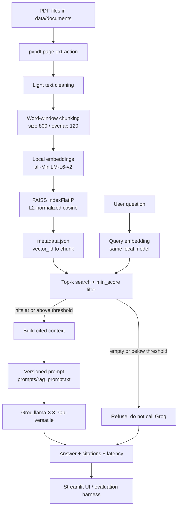

# NEXUS-RAG

Citation-grounded Retrieval-Augmented Generation for user-provided documents.

NEXUS-RAG answers questions using only text retrieved from a local PDF collection. Documents are ingested with pypdf, split into overlapping word chunks, embedded on-device with Sentence Transformers, and indexed in FAISS. At query time the system retrieves the most similar chunks, refuses to answer when evidence is missing or below a similarity threshold, and otherwise asks Groq to write a concise answer that cites source filename, page, and chunk ID. The Groq API key never appears in source control, logs, or the UI.

## Problem statement

Language models answer fluently even when they do not know the source of a claim. For document Q&A that is a defect, not a feature: an internship or operations reviewer needs to see *which page* supported the sentence. Fine-tuning a model on every new PDF is slow and opaque. A naive “stuff the whole PDF into the prompt” approach fails as soon as the corpus exceeds the context window and gives no ranked evidence trail.

The requirement is therefore a small, explainable pipeline that:

- accepts user PDFs
- retrieves the passages most similar to a question
- generates an answer only from those passages
- cites the source document and chunk
- fails closed when retrieval is empty, relevance is low, or the LLM is unavailable

## Why RAG was chosen

RAG separates *what the system knows* (the indexed corpus) from *how it writes* (the LLM). That split has three engineering consequences that match this project:

1. **Corpus updates do not require retraining.** Re-run ingestion after adding a PDF.
2. **Citations are structural, not decorative.** Each FAISS row maps to `chunk_id`, `source`, `page`, and `text` in `metadata.json`.
3. **Refusal is implementable.** If no chunk clears `RETRIEVAL_MIN_SCORE`, Groq is not called and the system returns a grounded “not enough information” message instead of guessing.

A parametric-only model cannot point at a page. A retrieve-only system can surface passages but cannot synthesize a short cited answer. RAG is the minimum architecture that does both without LangChain or LlamaIndex wrapping the control flow.

## Architecture



Control flow is ordinary Python. `RAGPipeline.answer()` is the only orchestration point: retrieve, filter, optionally generate, always return a structured dict.

## Technology stack

| Layer | Choice | Why this choice |
| --- | --- | --- |
| Runtime | Python 3.14 in `.venv` | One interpreter; all packages are installed there. On this Windows machine, bare `python` is system `C:\Python314\python.exe` and does **not** see project dependencies. |
| PDF extraction | pypdf | Direct page text plus page numbers; no cloud OCR. |
| Embeddings | Sentence Transformers `all-MiniLM-L6-v2` (384-d) | Runs locally, no embedding API, small enough for CPU demo, widely used for semantic search. |
| Vector index | FAISS CPU `IndexFlatIP` | Exact inner product. With L2-normalized vectors this is cosine similarity, which is easy to threshold and explain. |
| LLM | Groq `llama-3.3-70b-versatile` | The only paid/remote service; free-tier Groq is sufficient for the demo. Temperature is 0 so generation is as deterministic as the API allows. |
| Config | `src/config.py` + `.env` via python-dotenv | Paths, chunking, and thresholds are version-controlled. Secrets stay in `.env`, which is gitignored. |
| Prompt | `prompts/rag_prompt.txt` | The generation contract is a file, not a string buried in code. |
| UI | Streamlit | Fast path to a reviewer-facing demo without a custom frontend. |
| Tests | pytest | Ingestion, retrieval, pipeline failures, and evaluation harness are covered without calling Groq in CI. |

LangChain and LlamaIndex are intentionally unused. The pipeline is short enough that a framework would hide the decisions this assessment is meant to demonstrate.

## Project structure

```text
app.py                      Streamlit demo
requirements.txt            Pinned environment
.env.example                GROQ_API_KEY / GROQ_MODEL placeholders
prompts/rag_prompt.txt      Grounded-answering prompt

src/config.py               Single configuration module
src/ingest.py               CLI: python -m src.ingest
src/documents.py            PDF discovery and pypdf extraction
src/cleaning.py             Conservative whitespace cleanup
src/chunking.py             Deterministic overlapping chunks
src/embeddings.py           Local SentenceTransformer encode
src/indexer.py              FAISS write + metadata.json
src/retrieve.py             Retriever class (no Groq)
src/generate.py             Groq client, timeouts, auth/rate-limit handling
src/rag.py                  RAGPipeline.answer(question)

data/documents/             User PDFs
data/index/                 faiss.index + metadata.json (gitignored)

evaluation/eval_dataset.json
evaluation/evaluate.py
evaluation/results.json     Raw per-question output
evaluation/report.json      Summary metrics

tests/test_rag.py
```

## Installation

Use the **project** interpreter. Do not use the system `python` on PATH.

```powershell
cd C:\Users\LENOVO\Music\ASTRION-RAG
.\.venv\Scripts\python.exe -m pip install -r requirements.txt
```

If `.venv` does not exist yet:

```powershell
C:\Python314\python.exe -m venv .venv
.\.venv\Scripts\python.exe -m pip install -r requirements.txt
```

Confirm the active interpreter:

```powershell
.\.venv\Scripts\python.exe -c "import sys; print(sys.executable)"
```

It must print a path under this repo’s `.venv\Scripts\python.exe`.

## Environment variable setup

Copy the example file and edit **only** the local `.env` (never commit it, never paste keys into chat):

```powershell
copy .env.example .env
```

`.env.example`:

```text
GROQ_API_KEY=your_groq_api_key_here
GROQ_MODEL=llama-3.3-70b-versatile
```

Optional:

```text
GROQ_TIMEOUT_SECONDS=30
ASTRION_DEBUG=0
ASTRION_LOG_LEVEL=INFO
```

A missing or placeholder `GROQ_API_KEY` does not crash ingestion or retrieval. Generation returns a clear configuration error. Invalid `GROQ_TIMEOUT_SECONDS` is rejected before an API call.

## Document ingestion

1. Place PDF files in `data/documents/` (subfolders are scanned; non-PDFs are ignored and listed).
2. From the project root:

```powershell
.\.venv\Scripts\python.exe -m src.ingest
```

Ingestion extracts every page with pypdf, cleans wrap artifacts without rewriting wording, chunks with **800 words** and **120-word overlap** (word-equivalent tokens; not a subword tokenizer), embeds locally, and writes:

- `data/index/faiss.index`
- `data/index/metadata.json`

Chunk IDs are deterministic (`{stem}_p{page}_c{index:02d}`). Documents are processed in sorted order so re-ingestion of the same files is reproducible.

Corrupt, encrypted, or empty PDFs are recorded as failures; other files continue. Empty pages are not inserted into FAISS.

Last successful ingest of the sample PDFs:

- Documents processed: 2
- Pages processed: 5
- Chunks created: 5
- Embedding dimension: 384

## How to run the Streamlit application

```powershell
.\.venv\Scripts\python.exe -m streamlit run app.py
```

The UI shows indexed document and chunk counts, embedding model, LLM model, the answer, citations, retrieved chunks, a retrieval trace (source, page, chunk ID, score), and retrieval / generation / total latency.

## How to run evaluation

```powershell
.\.venv\Scripts\python.exe -m evaluation.evaluate
```

This loads `evaluation/eval_dataset.json` (14 items: 12 grounded questions plus 2 no-evidence questions), calls `RAGPipeline.answer()` for each, and writes:

- `evaluation/results.json`
- `evaluation/report.json`

API failures are stored under `failures` and do not abort the run.

## Evaluation methodology

Automatic scoring is limited to what can be checked without inventing quality:

| Metric | How it is computed |
| --- | --- |
| Retrieval hit | At least one **expected source filename** appears in retrieved sources. Items with empty `expected_sources` are not scored. |
| Latency | `retrieval_seconds`, `generation_seconds`, `total_seconds` from the pipeline. |
| Failures | Groq timeout, auth, rate limit, missing key, and unexpected errors recorded separately. |

**Not auto-scored** (left `null` for a human reviewer):

- `groundedness` — does the answer stay inside the retrieved text?
- `citation_score` — are cited chunk IDs actually used and correct?

The dataset includes two deliberate no-evidence questions (SOC phone number; Kubernetes CIDR). The correct system behavior is refusal, not a plausible guess.

## Actual evaluation results

Figures below are from `evaluation/report.json` generated at `2026-08-11T11:22:31Z`. **They are not a complete quality score.** Twelve of fourteen questions failed generation because `GROQ_API_KEY` was still the placeholder. Only questions that skipped Groq (empty retrieval) completed.

| Metric | Value |
| --- | --- |
| Total questions | 14 |
| Completed | 2 |
| Failed | 12 (`q01`–`q05`, `q07`–`q13`) |
| Failed reason | Groq not configured (`GROQ_API_KEY` placeholder) |
| Retrieval questions scored among completed | 1 |
| Retrieval hits among those | 0 |
| Retrieval hit rate (this run) | 0.0 |
| Groundedness | `null` (manual) |
| Citation score | `null` (manual) |

After a Groq-authenticated run, replace the following with values from a new `evaluation/report.json`:

- Full-set retrieval hit rate: `[INSERT ACTUAL RETRIEVAL HIT RATE]`
- Groundedness (manual): `[INSERT MANUAL GROUNDEDNESS SCORE]`
- Citation score (manual): `[INSERT MANUAL CITATION SCORE]`

## Latency measurements

**Completed eval items (retrieval only; Groq skipped):**

| | Seconds |
| --- | ---: |
| Average | 0.0186 |
| Minimum | 0.0168 |
| Maximum | 0.0205 |

These numbers **do not include LLM time**. First-process Sentence Transformer load is extra (on the order of several seconds) and is paid once per process, not per question.

Generation latency with a live Groq key:

- Average generation: `[INSERT ACTUAL AVERAGE GENERATION LATENCY]`
- Average total (retrieve + generate): `[INSERT ACTUAL AVERAGE TOTAL LATENCY]`

A one-off retrieval smoke test against the sample index returned `sample_network_security.pdf` page 1 for a firewall-policy question (cosine score 0.637). That is a sanity check, not an evaluation average.

## Cost estimation methodology

Embeddings and FAISS search run locally and have **no per-query API cost**.

Groq cost is estimated only for successful generations:

```text
cost ≈ (input_tokens / 1e6) * input_USD_per_1M
      + (output_tokens / 1e6) * output_USD_per_1M
```

Use the published rates for `llama-3.3-70b-versatile` on Groq’s pricing page at the time of measurement. Input tokens are the versioned prompt plus retrieved context; output tokens are the completion. Empty retrieval and configuration failures cost $0 because Groq is not called.

This repository has **not** yet recorded token usage from a successful Groq evaluation run:

- Estimated cost per successful request: `[INSERT ACTUAL COST PER REQUEST]`
- Groq input price used: `[INSERT GROQ INPUT USD PER 1M TOKENS]`
- Groq output price used: `[INSERT GROQ OUTPUT USD PER 1M TOKENS]`

Do not treat the Groq free tier as unlimited; rate limits are handled as a first-class failure (see below).

## Failure cases

The pipeline fails closed: it does not invent an answer to cover an error.

| Case | User-visible behavior |
| --- | --- |
| Missing `data/documents/` | Ingest exits with the path and how to add PDFs. |
| Corrupt / unreadable PDF | Logged as a document failure; other files continue. |
| Empty PDF / no extractable text | Reported; not written to FAISS. |
| Missing FAISS index or metadata | Structured message to run `python -m src.ingest`. |
| Empty retrieval | Groq skipped; “not enough information in the provided documents.” |
| Scores below `RETRIEVAL_MIN_SCORE` (0.25) | Groq skipped; “not sufficiently relevant.” |
| Groq timeout | “The language model timed out.” Retrieved chunks may still be shown. |
| Groq authentication failure | “Check GROQ_API_KEY in your local .env file.” The key is never logged. |
| Groq rate limit | “The language model is rate-limited. Please wait and try again.” |
| Invalid env (`GROQ_TIMEOUT_SECONDS`, empty model, placeholder key) | Configuration error before a bad API call. |
| Unexpected exception | Generic message; stack traces only if `ASTRION_DEBUG=1`. |

Two dataset items (`q13`, `q14`) are intentional no-evidence questions used to demonstrate refusal.

## Design decisions

**Word-equivalent chunks instead of a tokenizer.** `CHUNK_SIZE = 800` and `CHUNK_OVERLAP = 120` count whitespace-separated words. That keeps IDs and config understandable in an interview without adding a second tokenizer that would disagree with MiniLM’s subwords anyway.

**Overlap exists for boundary sentences.** A claim that starts at the end of one window and finishes in the next would otherwise be split across two vectors and retrieve poorly.

**Exact FAISS (`IndexFlatIP`) rather than HNSW/IVF.** The sample index is tiny. Approximate indexes add recall caveats that are hard to defend in a small assessment corpus. Normalization plus inner product is cosine similarity with a score in a range you can threshold.

**Threshold before generation.** Low-similarity neighbors are worse than no neighbors: they invite the LLM to answer from the wrong paragraph. Skipping Groq on a miss is cheaper and more honest.

**Prompt as a file.** Citation rules live in `prompts/rag_prompt.txt` so a reviewer can read the contract without opening Python.

**No LangChain.** The graph is six functions. A framework would obscure where filtering, refusal, and secret handling happen.

**Temperature 0.** The assessment cares about groundedness, not stylistic variety.

## Limitations

- pypdf extracts digital text only; scanned PDFs without a text layer will ingest as empty.
- Five sample chunks are enough to demonstrate the pipeline, not to measure retrieval quality at scale.
- `all-MiniLM-L6-v2` is a general English embedding model; domain jargon may retrieve poorly.
- Exact FAISS is not the right index for millions of vectors.
- Groq is a remote dependency: auth, rate limits, and timeouts are outside local control.
- Automatic evaluation does **not** score answer correctness; only source-filename hit/miss and latency.
- The last recorded eval run is incomplete without a real `GROQ_API_KEY`.

## Future improvements

- OCR path for scanned PDFs
- Larger, multi-document evaluation set with page-level expected sources
- LLM-as-judge *or* human rubric filled into `groundedness` / `citation_score`
- Hybrid lexical + dense retrieval for identifiers and error codes
- Token-accurate Groq usage logging for cost
- Approximate FAISS only after the corpus outgrows exact search
- Streaming tokens in Streamlit once refusal logic is unchanged

## Demo instructions

1. Install into `.venv` (see Installation).
2. Put a real Groq key in `.env` locally.
3. Confirm sample PDFs exist under `data/documents/` (or add your own).
4. Ingest:

```powershell
.\.venv\Scripts\python.exe -m src.ingest
```

5. Ask one grounded question:

```powershell
.\.venv\Scripts\python.exe -m src.rag "When is a firewall useful according to the documents?"
```

6. Ask a no-evidence question and confirm refusal:

```powershell
.\.venv\Scripts\python.exe -m src.rag "Which Kubernetes CIDR does the production cluster use?"
```

7. Open the UI:

```powershell
.\.venv\Scripts\python.exe -m streamlit run app.py
```

8. Run evaluation after Groq is configured:

```powershell
.\.venv\Scripts\python.exe -m evaluation.evaluate
```

9. Tests:

```powershell
.\.venv\Scripts\python.exe -m pytest tests/test_rag.py
```

Use `.\.venv\Scripts\python.exe` for every command so the system Python is not used by accident.
